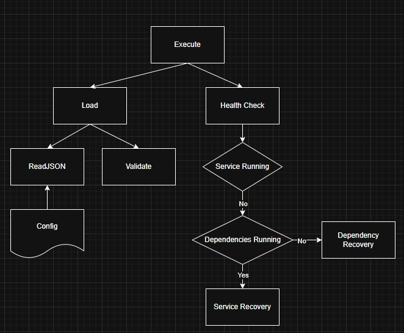

# ServiceWatchdog
A Service Watcher for Monitoring Services, Their Dependencies and Restart Options

Requirements
- Run via Service Manager
- Configured via JSON
- Monitor Services and Their Dependencies (Local and Network)
- Attempt to Restart Service (x) Times
- Only Send One Email to Notify Service Failed to Start, Restart Flag After Service Stabilises
- Run Scripts / Collect Logs as Part of Restart Attempts

Rough Logic

